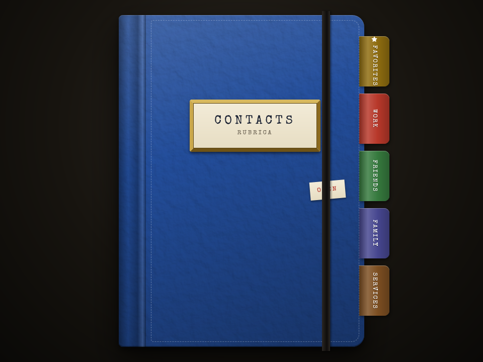
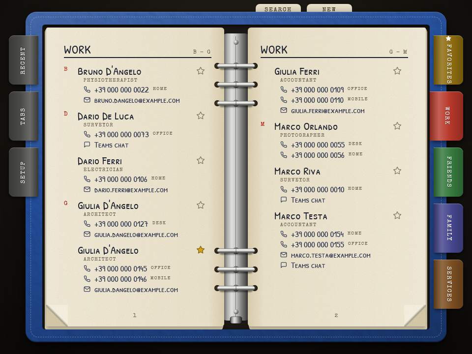
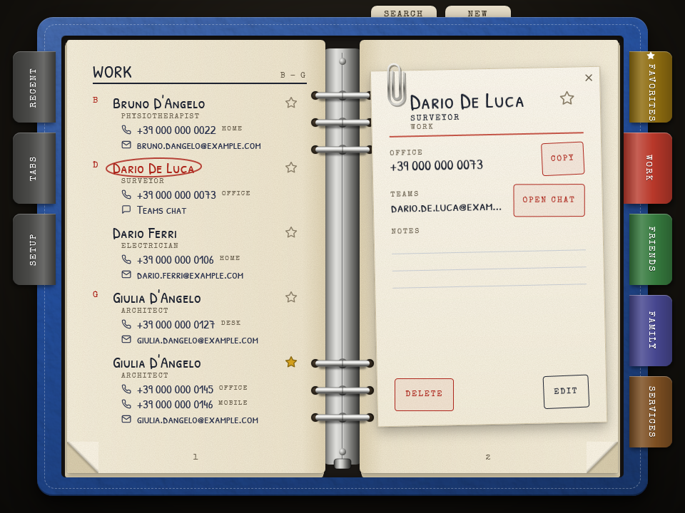
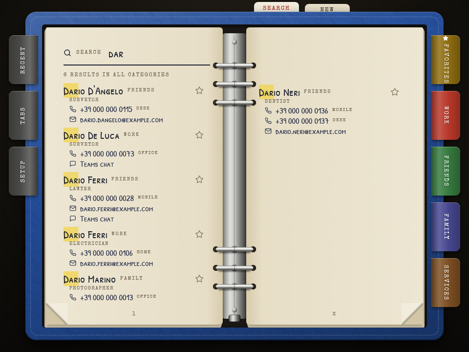
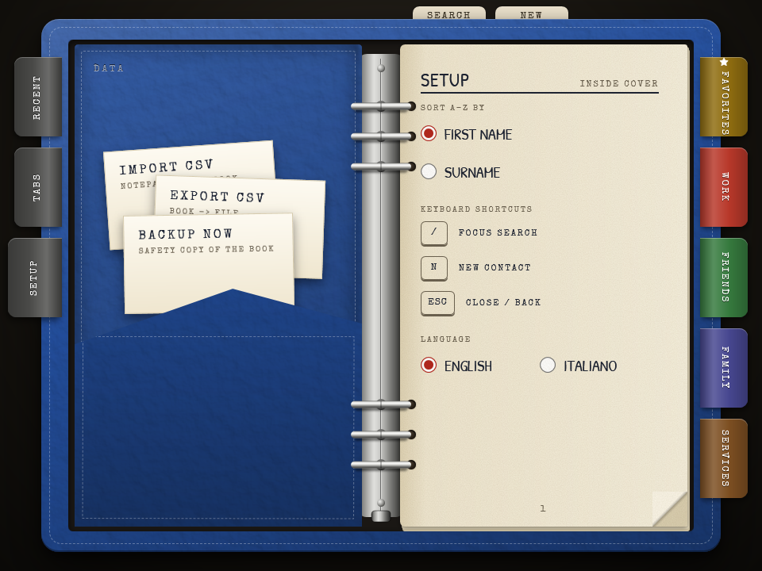

# Rubrica

A contacts book, drawn as the ring binder it replaces: coloured divider tabs for the
categories, a page of favorites, a paper clip on the card you are reading.



It keeps names, numbers, addresses and notes, and makes them quick to reach. It does
not place calls or send mail. A click copies a number or an address to the clipboard,
and one stamp opens the Teams chat with that person; that is all it reaches outside
itself.

One book per PC, no network, no account, in English or Italian. Windows 10 or later;
nothing else to install, because it runs on the .NET Framework that every Windows 10
already has.

## Getting it

Download `RubricaSetup.exe` from [Releases](https://github.com/CardamomFlower/Rubrica/releases) and run it.

It installs for you alone, into `%LOCALAPPDATA%\Programs\Rubrica`, so it never asks for
an administrator password. Two tick-boxes, both on to start with, offer a Start Menu
entry and a desktop shortcut. The installer is not signed: the first time, Windows may
say that it does not know the publisher - choose **More info**, then **Run anyway**.

Uninstall it from Settings > Apps like anything else. Your contacts are left where
they are unless you tick the box that says otherwise. Installing a newer version over
an older one replaces the program and keeps your contacts - if they were written by
version 0.1.0 they stay in the old folder until you start the new version once (see
**Where the book lives**).

## Leafing through it

Click the cover, or any tab, and the book opens. Each tab on the right is a category;
the gold one on top collects the favorites of every category. The folded corners at the
bottom turn the pages, and a red letter in the margin marks where each initial begins.



The star beside a name makes it a favorite. A click on a number or an address copies
it, and a strip of paper at the bottom says so. **Esc** goes back one step at a time,
down to the closed cover.

## A contact

Click a name and its card is clipped over the right-hand page: every number and
address with a **COPY** stamp beside it, **OPEN CHAT** when the contact has a Teams
account, the notes, and **EDIT** and **DELETE** at the bottom.



Put the card away with the **x** in its corner, a click on the paper clip, **Esc**, or
another click on the circled name. **DELETE** asks first, and for ten seconds
afterwards a strip offers **UNDO**.

## Finding people

Press **/** anywhere - or click the SEARCH tab - and type. The search looks through
every category at once, in names, roles, numbers and addresses, ignoring capitals and
accents; a number is found by its last digits, however it was written in the book -
with or without spaces and prefix.
With nothing typed it lists everybody in one alphabet.



The RECENT tab on the left lists the people you looked up last, with what you did -
opened the card, copied something, opened the chat - and when.

## Writing in it

**N**, or the NEW tab, opens an empty form; **EDIT** on a card opens the same form
filled in. Only the name is required. A contact may have up to three numbers, each
with its own label, an email address, a Teams account and notes. **Enter** saves,
**Esc** cancels - and asks first if you had typed something, as does any tab you click
while the form is open, and the window's own close button. There is no Save command
anywhere else: every change is written to disk the moment you make it.

The TABS page, on the left, renames the categories, moves them up and down, adds one
(six at most, six colours to choose from) and deletes one - asking where its contacts
should go, if it has any.

## In and out

The SETUP tab opens the inside of the cover, where three slips of paper wait in a
pocket.



**IMPORT CSV** reads two kinds of file.

- A CSV with a header row: `Name; Surname; Role; Category; Phone1; Label1; Phone2;
  Label2; Phone3; Label3; Email; Teams; Favorite; Notes`. The columns are found by
  name, in any order; the ones you do not have can be left out; `;` `,` and tab all
  work as separators.
- A plain list, the kind that lives in Notepad: one person per line, name first, then
  the number - `Mario Rossi 333 1234567`. The first word becomes the name, the rest the
  surname; a line without a number is taken for a title and left out. Rubrica asks
  which category the list goes under. A few names will be split wrong, and are quickly
  put right by hand.

Before anything is added a slip tells you what the file would bring: how many
contacts, how many are already in the book (same name and same first number: those are
left alone), which new tabs. Nothing is ever replaced. After the import the book opens
where the new contacts went, and **UNDO** is offered for ten seconds.

**EXPORT CSV** writes the whole book in that same format, so it can be read back
without losing anything. If you edit the file in Excel, format the phone columns as
text first, or Excel will turn `+39 06...` into a number.

**BACKUP NOW** saves a copy of the book wherever you say, under a dated name, and
remembers the folder for next time. Keep one off the PC. To restore a backup, close
Rubrica and copy the file over `book.xml` (see below).

The same page chooses whether the book is sorted by first name or by surname, and the
language: English or Italian. Until you pick one, Rubrica speaks Italian if Windows
does, English otherwise; the installer follows the same choice.

EXPORT writes the column names in English. IMPORT reads them in English or in Italian
(`Nome; Cognome; Ruolo; Categoria; Telefono1; Etichetta1; ...; Email; Teams; Preferito;
Note`).

## Where the book lives

In `%APPDATA%\Rubrica`:

| File | What |
|---|---|
| `book.xml` | The book. The only file that matters. |
| `book.bak` | The save before the last one. |
| `state.xml` | Window position, language, recent look-ups. Deleting it loses nothing of value. |

Version 0.1.0 kept these files in `%APPDATA%\CardamomTools\Rubrica`. The first time a
newer version starts it moves them here by itself, once, and takes the old folder away
with them. Nothing is lost if it cannot - that run keeps using the old folder and the
next start tries again. If you have a copy of that folder of your own, or a backup job
pointed at it, point it here instead.

If `book.xml` is ever damaged, Rubrica sets it aside under another name, opens
`book.bak` instead and tells you. If it is merely out of reach - another program is
holding it - Rubrica says so and stops, without touching anything. The files are plain
text: whoever can read your Windows profile can read them.

## If the window paints wrong

On an old graphics driver the window may come up garbled or empty. Close Rubrica,
press Win+R and run

```
"%LOCALAPPDATA%\Programs\Rubrica\Rubrica.exe" --software
```

It paints without the graphics card from then on, and the title bar says so. The same
line with `--hardware` goes back. (With Rubrica still open the option is refused: the
open copy would write its own setting back.)

## Building from source

You need the .NET SDK. Rubrica targets .NET Framework 4.6; if Visual Studio has not
installed that targeting pack, the SDK fetches the reference assemblies on the first
build.

```
dotnet build installer\RubricaSetup.csproj -c Release
```

builds the app and then the installer, which carries a copy of the app inside it:
`src\Rubrica\bin\Release\Rubrica.exe` and `installer\bin\Release\RubricaSetup.exe`.
The version number is in `Directory.Build.props`. The user interface is WPF written
entirely in C# - there is no XAML - and the program uses no third-party library.

## Licence

[GNU Affero General Public License v3.0](LICENSE).

The two typefaces are compiled into the program and keep their own licences, which sit
beside them in `src/Rubrica/Fonts`: Patrick Hand SC (SIL Open Font License 1.1) and
Special Elite (Apache License 2.0). The line icons are from Feather (MIT). See
[THIRD-PARTY-NOTICES.md](THIRD-PARTY-NOTICES.md); both files are attached to every
release beside the installer.
